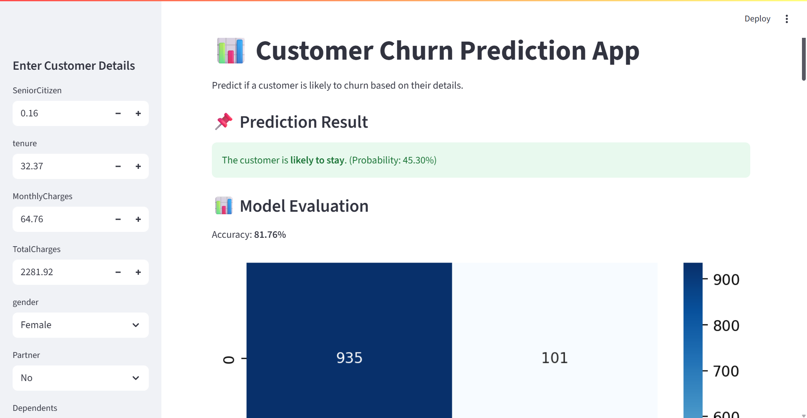
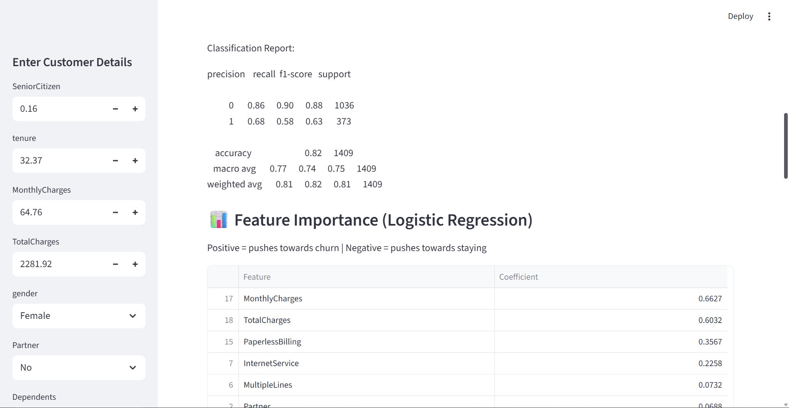

# Customer Churn Prediction Project

This project focuses on building a **Customer Churn Prediction** model using machine learning and generating **explainability insights** using SHAP values.

---

## 📌 Project Overview

Customer churn occurs when customers stop using a company's products or services. Predicting churn helps businesses retain customers through timely interventions.

This project includes:

* Exploratory Data Analysis (EDA)
* Data preprocessing and feature engineering
* Model training (such as Logistic Regression, Random Forest, XGBoost, etc.)
* Evaluation metrics
* SHAP explainability to interpret model predictions

---

## 📁 Project Structure

```
customerchurn/
│
├── churn4.py               # Main Python script for training & SHAP analysis
├── dataset.csv             # Input dataset (sample/customer data)
├── requirements.txt        # List of required Python packages
└── README.md               # Documentation
```

---

## 🚀 Installation & Setup

### 1. Clone the repository

```bash
 git clone <your-repo-url>
 cd customerchurn
```

### 2. Create and activate a virtual environment (recommended)

```bash
python -m venv venv
venv\Scripts\activate
```

### 3. Install dependencies

If you face SHAP/NumPy/Numba issues:

```bash
pip install numpy==1.26.4 numba==0.57.1 shap==0.41.0
```

Or install all dependencies:

```bash
pip install -r requirements.txt
```

---

## ▶️ Running the Project

Execute the main script:

```bash
python CustomerChurn.py
```

This will:

* Load data
* Train the model
* Generate performance metrics
* Display SHAP summary plots and feature importance

---

## 📊 Key Features of the Model

* **Handles categorical + numerical features**
* **Uses scalable machine learning classifiers**
* **Provides SHAP-based global & local explanations**
* **Visualizes most influential features contributing to churn**

---

## 🧠 Explainability with SHAP

The project uses SHAP to:

* Understand how each feature affects predictions
* Visualize global importance (summary plots)
* Explain individual customer churn predictions

Example outputs:

* SHAP beeswarm plot
* SHAP bar importance plot
* Force plots (optional)

---

## 📈 Model Evaluation Metrics

Typical metrics generated:

* Accuracy
* Precision, Recall
* F1 Score
* ROC-AUC Curve

---

## ⚠️ Troubleshooting

### ❌ Error: *Numba needs NumPy 2.2 or less. Got NumPy 2.3.*

Fix:

```bash
pip install "numpy<=2.2" --force-reinstall
pip install numba<=0.60
```

Or use the stable versions:

```bash
pip install numpy==1.26.4 numba==0.57.1 shap==0.41.0
```

If using Python 3.11+ and issues persist, create a Python 3.10 environment.

---

## 📬 Contact

For enhancements, issues, or contributions, feel free to open an issue or contact the project maintainer.

---

## 📷 Screenshots






